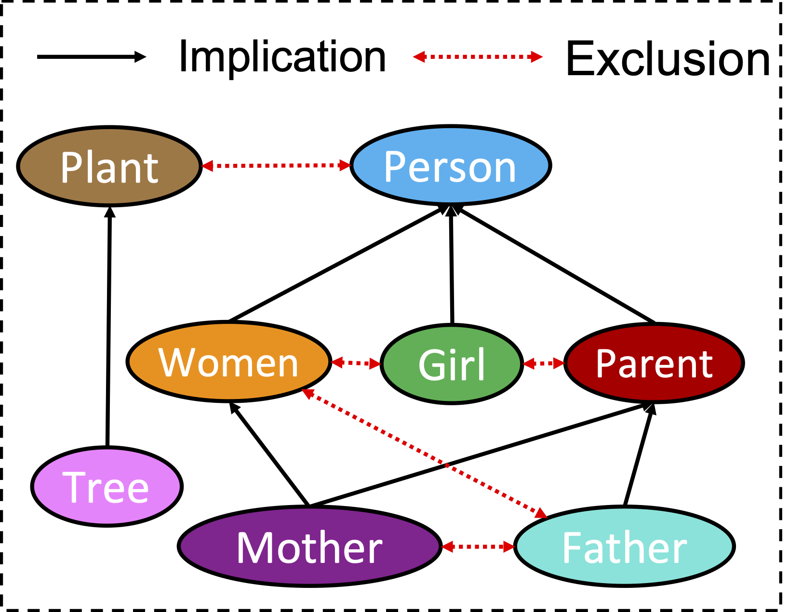

# HMI

PyTorch implementation of **Hyperbolic Embedding Inference for Structured Multi-Label Prediction (NeurIPS'22)**

## Requirements

- torch>=1.8.0
- geoopt (`$ pip install git+https://github.com/geoopt/geoopt.git`)
- numpy
- scipy
- pandas
- tqdm

## Toy example

HMI-toy-example.ipynb provides a toy example of HMI for embedding HEX graph.

Given the HEX graph (left), you will obtain the following output:

Hierarchy and exclusion (HEX) graph             |  Learning hyperbolic label embeddings
:-------------------------:|:-------------------------:
   |  

## Multi-label classification

To run HMI on "derisi_FUN" dataset, run the following scripts:

nohup python run.py --dataset derisi_FUN > logs/derisi_FUN.txt 2>&1 &

